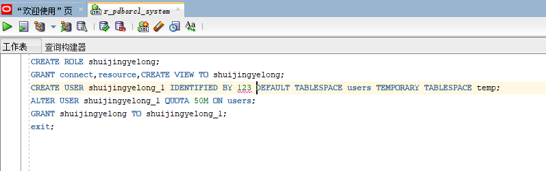
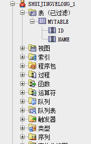
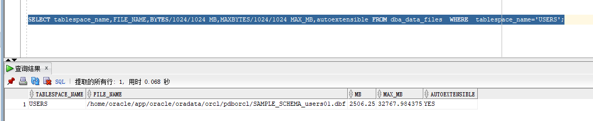
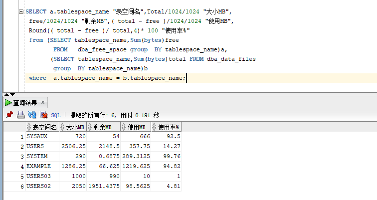
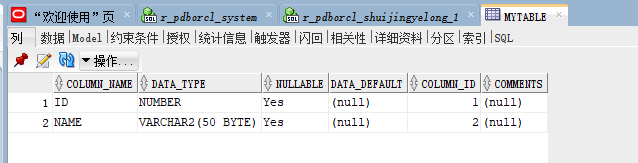
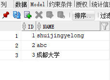
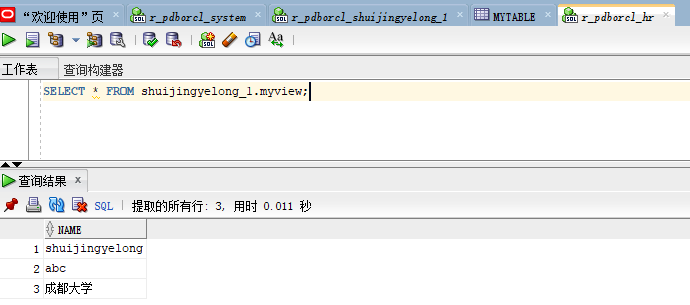
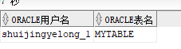

专业班级：18软工1班
姓名：罗林
学号：201710414112

# 实验2：用户及权限管理

## 实验目的

掌握用户管理、角色管理、权根维护与分配的能力，掌握用户之间共享对象的操作技能。

## 实验内容

Oracle有一个开发者角色resource，可以创建表、过程、触发器等对象，但是不能创建视图。本训练要求：

- 在202.115.82.8/czm插接式数据中创建一个新的本地角色XZF，该角色包含connect和resource角色，同时也包含CREATE VIEW权限，这样任何拥有XZF的用户就同时拥有这三种权限。
- 创建角色之后，再创建用户userXZF，给用户分配表空间，设置限额为50M，授予XZF角色。
- 最后测试：用新用户userXZF连接数据库、创建表，插入数据，创建视图，查询表和视图的数据。

## 实验参考步骤

对于以下的对象名称luolin，ll 。

- 第1步：以system登录到202.115.82.8/czm，创建角色luolin和用户userXZF，并授权和分配空间：

```sql
$ sqlplus system/123@202.115.82.8/czm
SQL> CREATE ROLE luolin;
Role created.
SQL> GRANT connect,resource,CREATE VIEW TO luolin;
Grant succeeded.
SQL> CREATE USER ll IDENTIFIED BY 123 DEFAULT TABLESPACE users TEMPORARY TABLESPACE temp;
User created.
SQL> ALTER USER ll QUOTA 50M ON users;
User altered.
SQL> GRANT luolin TO ll;
Grant succeeded.
SQL> exit
```

> 语句“ALTER USER userluolin QUOTA 50M ON users;”是指授权userluolin用户访问users表空间，空间限额是50M。

- 第2步：新用户userll连接到202.115.82.8/czm，创建表mytable和视图myview，插入数据，最后将myview的SELECT对象权限授予hr用户。

```sql
$ sqlplus userluolin/123@202.115.82.8/czm
SQL> show user;
USER is "useluolin"
SQL> CREATE TABLE mytable (id number,name varchar(50));
Table created.
SQL> INSERT INTO mytable(id,name)VALUES(1,'ll');
1 row created.
SQL> INSERT INTO mytable(id,name)VALUES (2,'ll');
1 row created.
SQL> CREATE VIEW myview AS SELECT name FROM mytable;
View created.
SQL> SELECT * FROM myview;
NAME
--------------------------------------------------
Xu
Zheng
SQL> GRANT SELECT ON myview TO hr;
Grant succeeded.
SQL>exit
```

- 第3步：用户hr连接到202.115.82.8/czm，查询userluolin授予它的视图myview

```sql
$ sqlplus hr/123@202.115.82.8/czm
SQL> SELECT * FROM userluolin.myview;
NAME
--------------------------------------------------
Xu
wang
SQL> exit
Zhe`


## 查看数据库的使用情况

```sql
$ sqlplus system/123@202.115.82.8/czm

SQL>SELECT tablespace_name,FILE_NAME,BYTES/1024/1024 MB,MAXBYTES/1024/1024 MAX_MB,autoextensible FROM dba_data_files  WHERE  tablespace_name='USERS';

SQL>SELECT a.tablespace_name "表空间名",Total/1024/1024 "大小MB",
 free/1024/1024 "剩余MB",( total - free )/1024/1024 "使用MB",
 Round(( total - free )/ total,4)* 100 "使用率%"
 from (SELECT tablespace_name,Sum(bytes)free
        FROM   dba_free_space group  BY tablespace_name)a,
       (SELECT tablespace_name,Sum(bytes)total FROM dba_data_files
        group  BY tablespace_name)b
 where  a.tablespace_name = b.tablespace_name;
```


- autoextensible是显示表空间中的数据文件是否自动增加。
- MAX_MB是指数据文件的最大容量。

## 实验截图


















